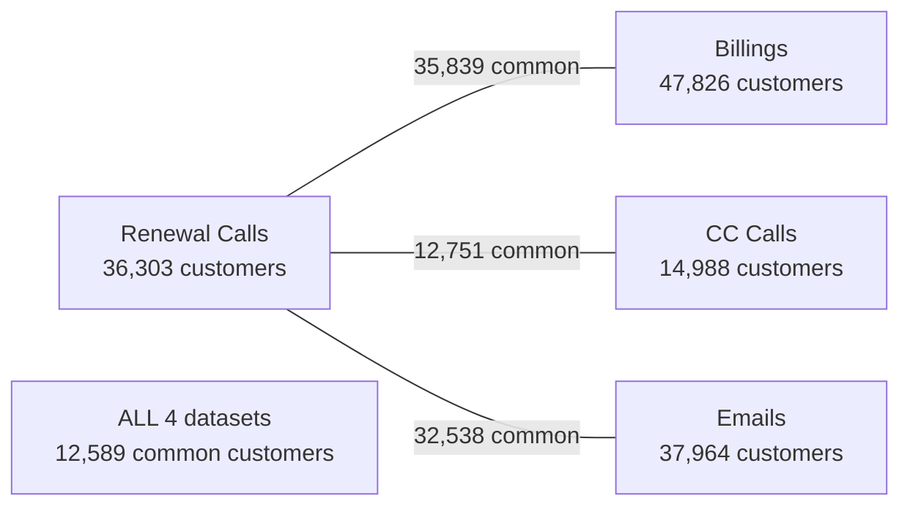

# 📊 Churn Dataset Analysis — Complete Column Guide

## Dataset Overview

| Dataset | Rows | Columns | Unique Customers | Duplicates | Memory |
|---------|------|---------|-------------------|------------|--------|
| **renewal_calls** | 186,534 | 41 | 36,303 | 28,812 ⚠️ | 290 MB |
| **billings** | 122,082 | 59 | 47,826 | 0 | 201 MB |
| **cc_calls** | 32,882 | 33 | 14,988 | 93 | 53 MB |
| **emails** | 123,389 | 27 | 37,964 | 0 | 168 MB |

> [!WARNING]
> `renewal_calls` has **28,812 duplicate rows** (15.4%) — these must be handled during cleaning.

---

## Customer Overlap

- **35,839** customers are in both Renewal Calls & Billings (98.7% of renewal customers)
- **12,589** customers appear in ALL 4 datasets
- Billings has the most customers (47,826) — it's the broadest dataset

---

## 🔴 RENEWAL_CALLS — Column-by-Column Analysis (41 columns)

This is **THE core dataset** — contains the churn label and call interaction details.

### Importance Legend
- 🟢 **HIGH** — Critical for churn prediction, must keep
- 🟡 **MEDIUM** — Useful context, keep if clean enough  
- 🔴 **LOW/DROP** — Little value or too noisy

| # | Column | Type | Nulls % | Importance | Meaning | Cleaning Notes |
|---|--------|------|---------|------------|---------|----------------|
| 1 | `Call_ID` | float64 | 0% | 🔴 DROP | Internal call identifier (only 53 unique values — seems like batch IDs) | Drop — not useful as feature |
| 2 | `Call_Direction` | str | 0% | 🟢 HIGH | Inbound vs Outbound call | Fix: `OUT_BOUND`→`Outbound`, `IN_BOUND`→`Inbound` |
| 3 | `Co_Ref` | str | 4.0% | 🟢 HIGH | **Customer ID** — the JOIN KEY across all datasets | Keep as identifier, drop 7,385 nulls |
| 4 | `Call_Date` | str | 0% | 🟢 HIGH | Date of the call (format: DD-MM-YYYY) | Parse to datetime |
| 5 | `Churn_Category` | str | **95.8%** | 🟢 **TARGET** | **Reason for churn** — 18 categories | This IS the churn label. NaN = Not churned. Top reasons: "Unnecessary", "Cost/Price", "Financial struggles" |
| 6 | `Complaint_Category` | str | 89.8% | 🟡 MEDIUM | What complaint was raised | High nulls but valuable — NaN means "no complaint" |
| 7 | `Customer_Reaction_Category` | str | 87.6% | 🟡 MEDIUM | How customer reacted during call | High nulls — only available for analysed calls |
| 8 | `Agent_Renewal_Pitch_Category` | str | 71.2% | 🟡 MEDIUM | What the agent pitched to renew | 18 categories, useful for understanding agent behavior |
| 9 | `Customer_Renewal_Response_Category` | str | 70.9% | 🟡 MEDIUM | Customer's response to renewal pitch | 20 categories |
| 10 | `Agent_Response_Category` | str | 71.1% | 🟡 MEDIUM | How agent responded back | 20 categories |
| 11 | `Membership_Renewal_Decision` | str | 53.6% | 🟢 HIGH | Was membership renewed? (Yes/No) | Very important — direct renewal outcome |
| 12 | `Serious_Complaint` | str | 54.8% | 🟢 HIGH | Was there a serious complaint? (Yes/No) | Only 0.3% said Yes — rare but impactful |
| 13 | `Other_Complaint` | str | 54.8% | 🟢 HIGH | Any other complaint? (Yes/No) | 10.8% said Yes |
| 14 | `Discussion_on_Price_Increase` | str | 52.8% | 🟢 HIGH | Was price increase discussed? | 4.5% Yes — key churn driver. Fix: `[Yes/No]`→split, `**No**`→`No` |
| 15 | `Renewal_Impact_Due_to_Price_Increase` | str | 52.8% | 🟡 MEDIUM | Did price increase affect renewal? | Dirty — has 21 unique values with noise. Clean to Yes/No |
| 16 | `Discount_or_Waiver_Requested` | str | 52.8% | 🟢 HIGH | Did customer ask for discount? | 33 unique values — dirty, clean to Yes/No |
| 17 | `Call_Reschedule_Request` | str | 52.5% | 🟡 MEDIUM | Did customer ask to reschedule? | Clean binary |
| 18 | `Agent_Flagged_Membership_Status_Alert` | str | 52.5% | 🟡 MEDIUM | Did agent flag a membership alert? | 14.4% Yes |
| 19 | `Agent_Renewal_Initiation` | str | 52.5% | 🟢 HIGH | Did agent initiate renewal? | 22.8% Yes — shows agent proactiveness |
| 20 | `Explicit_Competitor_Mention` | str | 52.4% | 🟢 HIGH | Did customer mention a competitor? | Only 0.8% Yes but very important for churn. Clean junk values (`XXXX`, `UNAVAILABLE`, `Prompt 2:`) |
| 21 | `Unnamed: 20` | float64 | **100%** | 🔴 DROP | Completely empty column | **DELETE immediately** |
| 22 | `Explicit_Switching_Intent` | str | 52.4% | 🟢 HIGH | Intending to switch provider? | Very rare (0.04% Yes) but strongest churn signal |
| 23 | `Mentioned_Competitors` | str | 52.4% | 🟡 MEDIUM | Which competitors were named? | 3.8% Yes. Clean junk values |
| 24 | `Price_Switching_Mentioned` | str | 52.5% | 🟡 MEDIUM | Price-based switching discussed? | 1.7% Yes. Clean format junk |
| 25 | `Competitor_Value_Comparison` | str | 52.5% | 🟡 MEDIUM | "Better Value" / "Similar Value" etc. | 82 unique — mostly "Not Applicable" or "Not Discussed" |
| 26 | `Competitor_Benefits_Mentioned` | str | 53.6% | 🟡 MEDIUM | What competitor benefits mentioned? | 350 unique values — very noisy free-text |
| 27 | `Topic_Introduced_By` | str | 52.4% | 🟡 MEDIUM | Who brought up the topic? (Agent/Customer) | Clean — 3 values only |
| 28 | `Percentage_Price_Increase_Mentioned` | str | 52.4% | 🟡 MEDIUM | Was % price increase stated? | 0.4% Yes |
| 29 | `Monetary_Price_Increase_Mentioned` | str | 52.4% | 🟡 MEDIUM | Was £ amount increase stated? | 1.6% Yes |
| 30 | `Price_Range_Mentioned` | str | 52.4% | 🔴 LOW | Actual price range (e.g., "£579 to £599") | 3,107 unique — too granular to use as-is |
| 31 | `Customer_Asked_For_Justification` | str | 52.4% | 🟡 MEDIUM | Did customer ask to justify price? | 3.1% Yes |
| 32 | `Customer_Response` | str | 52.4% | 🟢 HIGH | Reaction: Positive / Neutral / Negative | Great feature — 3.1% Negative, 31.5% Neutral |
| 33 | `Desire_To_Cancel` | str | 52.4% | 🟢 HIGH | Did customer want to cancel? | Key: "Renewed" 21.6%, "Desired to Cancel" 5.8%. **Very dirty — 474 unique values!** Clean to: Renewed/Desired to Cancel/Not Discussed |
| 34 | `Discount_Offered` | str | 52.4% | 🟢 HIGH | Was a discount actually offered? | 3.6% Yes — directly affects retention |
| 35 | `Justification_Category` | str | 93.0% | 🟡 MEDIUM | Why customer justified their churn | 30 categories, 93% null — only for analyzed churn calls |
| 36 | `Reason_For_Renewal_Category` | str | 91.4% | 🟡 MEDIUM | Why customer decided to renew | 23 categories — only for renewals |
| 37 | `Agent_Response_To_Cancel_Category` | str | **97.4%** | 🔴 LOW | How agent responded to cancellation | Very sparse — consider dropping |
| 38 | `Argument_That_Convinced_Customer_to_Stay_Category` | str | **99.0%** | 🔴 LOW | What convinced them to stay? | Only 1,818 non-null — too sparse |
| 39 | `Analysed_Call` | float64 | 52.4% | 🔴 DROP | Flag: was this call analysed? (always 1.0) | Meta-column — tells which rows have data. Drop |
| 40 | `Call_Number` | int64 | 0% | 🟡 MEDIUM | Sequence number of calls | Median=4, some customers have 7000+ calls! |
| 41 | `Call_Year` | int64 | 0% | 🔴 DROP | Year extracted from date | Redundant — can derive from `Call_Date` |

> [!IMPORTANT]
> **~52% of rows are "unanalysed calls"** (Analysed_Call = NaN). These rows have NaN for most columns (11-38). This is by design — only ~88K of 186K calls were processed by the AI analysis. The unanalysed rows still have Call_ID, Direction, Co_Ref, Call_Date, Call_Number, and Call_Year.

---

## 🔵 BILLINGS — Column-by-Column Analysis (59 columns)

This dataset has **billing/pricing data** and the **`Prospect_Outcome`** column which directly states Won/Churned/Open status.

| # | Column | Nulls % | Importance | Meaning |
|---|--------|---------|------------|---------|
| 1 | `Co_Ref` | 0% | 🟢 HIGH | Customer ID (join key) |
| 2 | `Renewal_Month` | 0% | 🟡 MEDIUM | Month when renewal was due |
| 3 | `Connection_Net` | **93.4%** | 🔴 LOW | Connection fee (net) — very sparse |
| 4 | `Connection_Qty` | **93.4%** | 🔴 LOW | Number of connections — very sparse |
| 5 | `Discount_Amount` | 88.9% | 🟡 MEDIUM | Discount percentage offered (20%, 30%, 50%...) |
| 6 | `Sustainability_Score` | 0% | 🟢 HIGH | Score: 8.0, 9.0, or 9.5 |
| 7 | `Total_Renewal_Score_New` | 0% | 🟢 HIGH | Overall renewal likelihood score (30.5-46.5) |
| 8 | `Starting_Connection_Net` | 93.0% | 🔴 LOW | Starting connection price — sparse |
| 9 | `Starting_Connection_Qty` | 93.0% | 🔴 LOW | Starting connection count — sparse |
| 10 | `Last_Years_Price` | 7.4% | 🟢 HIGH | What customer paid last year (mean £1,064) |
| 11 | `Last_Years_Date_Paid` | **100%** | 🔴 DROP | Completely empty |
| 12 | `Auto_Renewal_Score` | 0% | 🟢 HIGH | Auto-renewal score (8 or 9) |
| 13 | `Status_Scores` | 0% | 🟢 HIGH | Status score (0, 7, 8, or 9) |
| 14 | `Anchoring_Score` | 0% | 🟢 HIGH | Client anchoring score (7.5-9.5) |
| 15 | `Tenure_Scores` | 0% | 🟢 HIGH | Tenure-based score (7.0-9.5) |
| 16 | `Proforma_Auto_Renewal` | 14.8% | 🟢 HIGH | Is auto-renewal on? (True/False) |
| 17 | `Proforma_World_Pay_Token` | 14.8% | 🟡 MEDIUM | Has payment token? (True/False) |
| 18 | `Proforma_Date` | 0.2% | 🟡 MEDIUM | Date proforma was created |
| 19 | `Current_Anchorings` | 0% | 🟢 HIGH | Number of client connections (anchors) |
| 20 | `Current_Anchor_List` | 21.3% | 🟡 MEDIUM | Names of anchor clients (e.g., CBRE, Mitie) |
| 21 | `Payment_Timeframe` | 17.1% | 🟢 HIGH | Days: negative=paid late, 0=on time, positive=early |
| 22 | `Registration_Date` | 0.8% | 🟡 MEDIUM | When customer registered |
| 23 | `Proforma_Account_Stage` | 7.6% | 🟢 HIGH | Published / Membership Only / Renewal Process / etc. |
| 24 | `Proforma_Audit_Status` | 7.6% | 🟡 MEDIUM | Accredited / Failed / In progress — 31 categories |
| 25 | `Current_Auto_Renewal_Flag` | 0% | 🟢 HIGH | Auto-renewal on/off (y/n) — 94% have it ON |
| 26 | `Current_World_Pay_Token` | 0% | 🟡 MEDIUM | Has payment method saved (y/n) |
| 27 | `Renewal_Score_At_Release` | 0.1% | 🟢 HIGH | Renewal prediction score when released (15.5-28.2) |
| 28 | `Proforma_Membership_Status` | 0.1% | 🟢 HIGH | Accredited (73.8%) / Member Only / In Progress |
| 29 | `Proforma_Approved_Lists` | 0.1% | 🟡 MEDIUM | How many approved lists they're on |
| 30 | `Tenure_Years` | 0.8% | 🟢 HIGH | How long customer has been with company (0-30 yrs) |
| 31 | `Band` | 0% | 🟢 HIGH | Pricing band (A through J + Group) |
| 32 | `Prospect_Renewal_Date` | 0% | 🟡 MEDIUM | When renewal is due |
| 33 | `Closed_Date` | 6.7% | 🟡 MEDIUM | When the prospect was closed |
| 34 | `Prospect_Status` | 0% | 🟡 MEDIUM | 46 unique statuses — top is "Renewed" (77.7%) |
| 35 | `Starting_Net` | 0% | 🟢 HIGH | Starting price (net, mean £1,108) |
| 36 | `Starting_Vat` | 0% | 🔴 LOW | VAT amount — derived from Starting_Net |
| 37 | `Starting_Gross` | 0% | 🔴 LOW | Gross = Net + VAT — redundant |
| 38 | `Starting_Membership_Net` | 0% | 🟡 MEDIUM | Membership component of price |
| 39 | `Starting_Package_Net` | 0% | 🟡 MEDIUM | Package component |
| 40 | `Starting_PQQ_Net` | 0% | 🟡 MEDIUM | PQQ component |
| 41 | `Gross` | 0% | 🔴 LOW | Current gross price — redundant with Net |
| 42 | `Membership_Net` | 0% | 🟡 MEDIUM | Current membership net price |
| 43 | `Package_Net` | 0% | 🟡 MEDIUM | Current package net (52.6% is £0) |
| 44 | `PQQNet` | 0% | 🟡 MEDIUM | Current PQQ net |
| 45 | `Total_Net_Paid` | 17.1% | 🟢 HIGH | What was actually paid (mean £1,078) |
| 46 | `Prospect_Outcome` | 0% | 🟢 **TARGET** | **Won (82.9%) / Churned (10.4%) / Open (6.7%)** |
| 47 | `Payment_Method` | 0% | 🟢 HIGH | CARD (58.2%) / BACS (27.2%) / UNKNOWN / etc. |
| 48 | `Amount` | 0% | 🟢 HIGH | Billing amount (identical to Starting_Net) |
| 49 | `Total_Amount` | 0% | 🔴 LOW | Total amount — correlated with Amount |
| 50 | `Connection_Group` | 0.1% | 🟡 MEDIUM | Independent / 1 / 2 / 3 / 4 to 9 / 10+ |
| 51 | `Tenure_Group` | 0.8% | 🟡 MEDIUM | 1 / 2 / 3 / 4+ years |
| 52 | `#_of_Connection` | 0.1% | 🟡 MEDIUM | Number of connections (same as Current_Anchorings) |
| 53 | `Last_Renewal` | 39.6% | 🟡 MEDIUM | Date of last renewal |
| 54 | `Last_Band` | 39.6% | 🟡 MEDIUM | Pricing band at last renewal |
| 55 | `Last_Total_Net_Paid` | 39.6% | 🟡 MEDIUM | What they paid last time |
| 56 | `Last_Connections` | 39.6% | 🟡 MEDIUM | Connections they had last time |
| 57 | `Anchor_Group` | 0.1% | 🔴 LOW | Same as Connection_Group — duplicate |
| 58 | `Renewal_Year` | 0% | 🟡 MEDIUM | 2023-2026 |
| 59 | `DateTime_Out` | 0% | 🔴 LOW | Same as Renewal_Month — duplicate |

> [!IMPORTANT]
> **`Prospect_Outcome`** in billings is basically another churn label! **Won = Retained, Churned = Churned**. The churn rate here is **10.4%** (12,668 out of 122,082). This can be used instead of/alongside the `Churn_Category` from renewal_calls.

---

## 🟣 CC_CALLS — Column-by-Column Analysis (33 columns)

Customer care/support call data. Smaller dataset (32K rows, 15K customers).

| # | Column | Nulls % | Importance | Meaning |
|---|--------|---------|------------|---------|
| 1 | `Contact_ID` | 0% | 🔴 DROP | Call batch ID |
| 2 | `Call_Date` | 0% | 🟡 MEDIUM | Date of CC call |
| 3 | `Direction` | 0% | 🟡 MEDIUM | OUT_BOUND (75.6%) / IN_BOUND (24.4%) |
| 4 | `cc_care_package` | 0.4% | 🟡 MEDIUM | Service package: Standard/Express/Premier |
| 5 | `cc_care_package_discussed` | 0.4% | 🟡 MEDIUM | Was care package discussed? (21.1% Yes) |
| 6 | `cc_urgency_getting_on_site` | 0.4% | 🟢 HIGH | Urgent to get on worksite? (10.3% Yes) |
| 7 | `cc_external_consultant` | 0.4% | 🟡 MEDIUM | Using external consultant? (10.5% Yes) |
| 8 | `cc_agent_cross_sell_attempt` | 0.4% | 🟡 MEDIUM | Did agent try to cross-sell? (3.6% Yes) |
| 9 | `cc_customer_issues_concerns` | 0.4% | 🟢 HIGH | Customer has issues/concerns? (10.3% Yes) |
| 10 | `cc_business_struggles_financial_hardship` | 0.4% | 🟢 HIGH | Financial hardship? (3.0% Yes) — churn signal |
| 11 | `cc_call_initiated_by` | 0.4% | 🟡 MEDIUM | Customer (68.6%) / Agent (25.8%) |
| 12 | `cc_questionnaire_completion` | 0.1% | 🟡 MEDIUM | Completed questionnaire? (19.7% Yes) |
| 13 | `cc_chasing_response` | 0.1% | 🟡 MEDIUM | Chasing customer for response? (24.1% Yes) |
| 14 | `cc_issues_within_questionnaire` | 1.4% | 🟡 MEDIUM | Questionnaire issues? (13.2% Yes) |
| 15 | `cc_login_issues` | 0.1% | 🟡 MEDIUM | Login problems? (5.2% Yes) |
| 16 | `cc_platform_issues` | 0.1% | 🟡 MEDIUM | Platform issues? (7.0% Yes) |
| 17 | `cc_dissatisfaction_time_to_complete` | 0.1% | 🟢 HIGH | Unhappy with completion time? (4.5% Yes) |
| 18 | `cc_process_complexity_concerns` | 0.1% | 🟢 HIGH | Process too complex? (10.0% Yes) — churn signal |
| 19 | `cc_questions_harder_than_expected` | 0.1% | 🟡 MEDIUM | Questions too hard? (0.4% Yes) — rare |
| 20 | `cc_dissatisfaction_support` | 0.1% | 🟢 HIGH | Unhappy with support? (2.2% Yes) |
| 21 | `cc_contractor_sentiment` | 0.3% | 🟢 HIGH | **Satisfied (49.4%) / Neutral (39.7%) / Dissatisfied (3.0%)** |
| 22 | `cc_contractor_sentiment_start_score` | 0.3% | 🟡 MEDIUM | Sentiment at call start (20-100) |
| 23 | `cc_contractor_sentiment_end_score` | 0.3% | 🟡 MEDIUM | Sentiment at call end (20-100) |
| 24 | `cc_contractor_sentiment_overall_score` | 0.3% | 🟢 HIGH | Overall sentiment score |
| 25 | `cc_contractor_sentiment_issues_score` | 0.3% | 🟡 MEDIUM | Issues-specific sentiment |
| 26 | `cc_pricing_mentioned` | 0.3% | 🟢 HIGH | Was pricing discussed? (12.4% Yes) |
| 27 | `cc_pricing_sentiment_impact` | 0.3% | 🟢 HIGH | Did pricing affect sentiment? (3.3% Yes) |
| 28 | `cc_refund_discussed` | 0.3% | 🟡 MEDIUM | Refund discussed? (0.6% Yes) — rare |
| 29 | `cc_contractor_suggest_leave` | 0.3% | 🟢 HIGH | **Did customer suggest leaving? (2.5% Yes)** — strong churn signal |
| 30 | `cc_contractor_complained` | 0.3% | 🟢 HIGH | Did customer complain? (7.2% Yes) |
| 31 | `Co_Ref` | 3.6% | 🟢 HIGH | Customer ID (join key) |
| 32 | `Analysed_Call` | 0% | 🔴 DROP | Always 1 — meta column |
| 33 | `Call_Year` | 0% | 🔴 DROP | Can derive from Call_Date |

---

## 🟠 EMAILS — Column-by-Column Analysis (27 columns)

Email communication analysis — customer engagement patterns.

| # | Column | Nulls % | Importance | Meaning |
|---|--------|---------|------------|---------|
| 1 | `Co_Ref` | 0% | 🟢 HIGH | Customer ID |
| 2 | `Time_to_Renewal` | 0% | 🟢 HIGH | When in renewal cycle: prior_year / 45_out / 14_out / pre_renewal |
| 3 | `crm_accreditation_completed` | 17.0% | 🟢 HIGH | Accreditation complete? Yes/No/Not Discussed |
| 4 | `crm_timely_completion` | 17.0% | 🟡 MEDIUM | Done on time? (only 2.3% Yes) |
| 5 | `crm_progress_towards_accreditation` | 17.0% | 🟡 MEDIUM | Making progress? (43.3% Yes) |
| 6 | `crm_delays_in_accreditation` | 17.0% | 🟢 HIGH | Delays? (32.7% Yes) — dirty junk values |
| 7 | `crm_contractor_suggested_leave` | 17.0% | 🟢 HIGH | **Suggested leaving? (7.0% Yes)** — churn signal |
| 8 | `crm_contractor_engagement` | 17.0% | 🟢 HIGH | Engaged? (57.6% Yes) |
| 9 | `crm_contractor_sentiment` | 17.0% | 🟢 HIGH | Neutral (43.4%) / Satisfied (9.2%) / Dissatisfied (5.0%) |
| 10 | `crm_contractor_sentiment_score` | 17.0% | 🟡 MEDIUM | Sentiment score (numeric) |
| 11 | `crm_dts_or_ssip_mentioned` | 17.0% | 🟡 MEDIUM | DTS/SSIP competitor mentioned? (31.4% Yes) |
| 12 | `crm_customer_payment_intention` | 17.0% | 🟢 HIGH | Intending to pay? (22.9% Yes, 3.8% No) |
| 13 | `crm_competitors_mentioned` | 9.0% | 🟢 HIGH | Competitor mentioned? (4.6% Yes) |
| 14 | `crm_membership_level` | 9.0% | 🟡 MEDIUM | In progress / Accredited / etc. |
| 15 | `crm_platform_issues_raised` | 9.0% | 🟡 MEDIUM | Platform issues? (5.9% Yes) |
| 16 | `crm_agent_chased_contractor` | 9.0% | 🟡 MEDIUM | Agent followed up? (60.8% Yes) |
| 17 | `crm_agent_chase_count` | 9.0% | 🟡 MEDIUM | How many follow-ups (0-5+) |
| 18 | `crm_accreditation_issues` | 9.0% | 🟡 MEDIUM | Issues with accreditation? (36.3% Yes) |
| 19 | `crm_membership_overdue` | 9.0% | 🟢 HIGH | Membership overdue? (24.4% Yes) — churn signal |
| 20 | `crm_auto_renewal_status` | 9.0% | 🟡 MEDIUM | Auto-renewal: 0 (85.2%) / 1 / 2 |
| 21 | `crm_dissatisified_with_renewal_price` | 9.0% | 🟢 HIGH | Unhappy with price? (6.9% Yes) — churn signal |
| 22 | `crm_customer_complained` | 9.3% | 🟢 HIGH | Complained? (6.1% Yes) |
| 23 | `crm_refund_mentioned` | 9.3% | 🟡 MEDIUM | Refund mentioned? (1.4% Yes) |
| 24 | `crm_negative_customer_experience` | 9.3% | 🟢 HIGH | Negative experience? (14.9% Yes) |
| 25 | `crm_dissatisfaction_with_support` | 9.3% | 🟢 HIGH | Unhappy with support? (8.7% Yes) |
| 26 | `crm_financial_hardship_mentioned` | 9.3% | 🟢 HIGH | Financial hardship? (5.3% Yes) |
| 27 | `year` | 0% | 🔴 DROP | Year — redundant |

---

## 🧹 Top Cleaning Priorities

> [!CAUTION]
> These issues MUST be fixed before any modeling!

1. **Remove duplicates** — 28,812 in renewal_calls
2. **Drop empty columns** — `Unnamed: 20` (renewal), `Last_Years_Date_Paid` (billings)
3. **Standardize call direction** — `OUT_BOUND`→`Outbound`, `IN_BOUND`→`Inbound` (in both renewal_calls AND cc_calls)
4. **Clean junk values** — `[Yes/No]`, `**No**`, `XXXX`, `UNAVAILABLE`, `Prompt 2:`, etc. scattered across many columns
5. **Fix Desire_To_Cancel** — 474 unique values! Consolidate to: `Renewed` / `Desired to Cancel` / `Not Discussed`
6. **Parse all dates** to datetime format
7. **Drop redundant columns** — `Call_Year`, `Analysed_Call`, `Starting_Vat`, `Starting_Gross`, `Anchor_Group`, `DateTime_Out`

## 🎯 Columns to Use as Churn Label

You have **two options** for your target variable:

| Option | Column | Source | Churn Rate |
|--------|--------|--------|-----------|
| A | `Churn_Category` (notna) | renewal_calls | ~4.2% (7,902 of 186K rows) |
| B | `Prospect_Outcome == "Churned"` | billings | **10.4%** (12,668 of 122K rows) |

> [!TIP]
> **Option B from billings** is cleaner and more balanced. Consider using `Prospect_Outcome` as your primary churn label and enriching with features from all 4 datasets.
